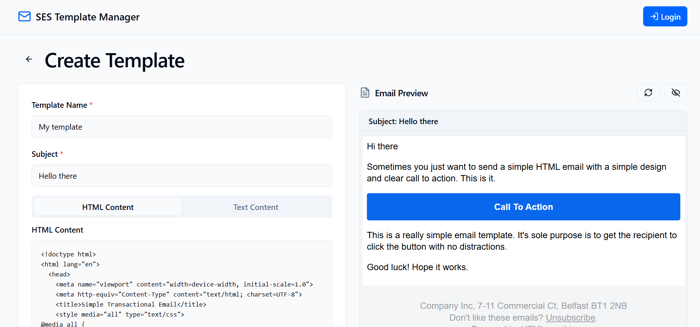

# SES Template Manager

SES Template Manager is a web application for managing and sending emails using AWS SES (Simple Email Service).

## Screenshot



## Features

- Manage SES email templates with a clean UI.
- User-friendly interface with modern UI components.

## Installation

1. Clone the repository:
   ```bash
   git clone https://github.com/chihebnabil/ses-template-manager
   cd ses-template-manager


2. Install dependencies:
   ```bash
   npm install
   ```

3. Start the development server:
   ```bash
   npm run dev
   ```

## Usage

- Open the application in your browser.
- Configure your AWS SES credentials.
- Manage templates and send emails.

## Important Note

**Credentials Storage**: AWS SES credentials are stored in the browser's `localStorage`. Ensure that you are using the application in a secure environment to prevent unauthorized access.


## License

This project is licensed under the MIT License.
